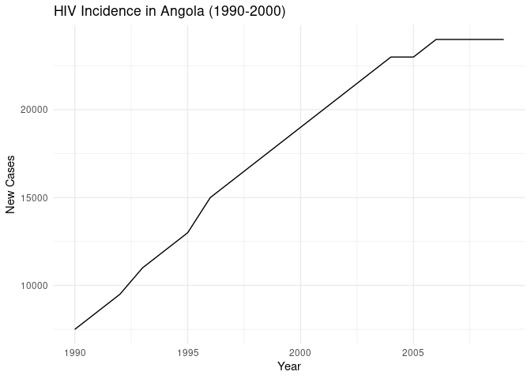

# TGCdatasets

## Overview

`TGCdatasets` is an R package providing a collection of curated datasets
for epidemiological studies and public health data analysis, with a
focus on The Graph Network.

## Installation

To install the latest version of `TGCdatasets` from GitHub, use the
following command in R:

``` r
# install.packages("devtools") # if you have not installed devtools package
devtools::install_github("ielbadisy/TGCdatasets")
```

## License

This package is licensed under the GPL-3 license. See the
[LICENSE](LICENSE) file for more details.

## Usage

After installation, you can load the package as usual:

``` r
library(TGCdatasets)
```

### Uploading Dataset

To upload your dataset into `TGCdatasets`, follow these steps:

1.  Prepare your dataset in a standard R data format (e.g., `.rda`).
2.  Submit a pull request to the GitHub repository with your dataset and
    documentation.

### Example

Here’s a short example of analyzing the `hiv_incidence` dataset included
in `TGCdatasets`:

``` r
library(TGCdatasets)
library(ggplot2)

## load the data
data("hiv_incidence")

ggplot(subset(hiv_incidence, country == "Angola"), aes(x = year, y = new_cases)) +
  geom_line() +
  theme_minimal() +
  labs(title = "HIV Incidence in Angola (1990-2000)",
       x = "Year",
       y = "New Cases")
```

<!-- -->

This will generate a line plot showing the trend of HIV incidence in
Angola from 1990 to 2000.

## Contributing

Contributions to `TGCdatasets` are welcome! Please read our
[CONTRIBUTING.md](CONTRIBUTING.md) file for guidelines on how to
contribute.

## Contact

For any queries or suggestions, please contact the maintainer at
<email@thegraphnetwork.org>.
